# Daten visualisieren {#sec-chapter-daten-visualisieren}

::: {.callout-warning}
## Work in Progress
:::

In R erstellen wir Plots mit Hilfe der `ggplot2`-Funktionen. Anders als in Excel werden mit diesen Funktionen Plots schrittweise aufgebaut und können auf diese Weise einheitlich reproduziert werden. 

<!-- 
Eine umfassende Einführung zu den Funktionen und Konzepten von `ggplot2` gibt das Buch von [Wickham (2021)](https://ggplot2-book.org/). Dieses Buch erläutert alle relevanten Konzepte und Tricks für die gängigsten Visualisierungen. 
-->

Wir erzeugen eine Datenvisualisierung immer mit den folgenden Funktionsaufrufen:

1. Wir initiieren einen Plot mit der Angabe der darzustellenden Vektoren.
2. Anschliessend wählen wir die Darstellung der Datenpunkte mit einer *Geometriefunktion* aus. 

::: {.callout-warning}
## Achtung
`ggplot2` verwendet zur Funktionsverkettung den `+`-Operator und nicht wie der Rest der modernen R-Funktionen den Verkettungsoperator `%>%`. Wir können also leicht erkennen, dass ein Code-Fragment einen Plot erzeugt, wenn Funktionen mit `+` verkettet sind.
:::

Mit den folgenden Funktionsaufrufen erzeugen wir ein einfaches Punktdiagramm. Als Beispielstichprobe verwenden wir hier die `iris`-Daten, die mit R mitgeliefert werden. 

```R
iris %>%
   ggplot(aes(x = Sepal.Length, y = Petal.Length)) + 
       geom_point()
```

Das Ergebnis dieser Operation zeig @fig-plot-iris-points. 

{#fig-plot-iris-points}

## Technischer Aufbau von Visualisierungen

In der ersten Zeile legen wir fest, welche Daten visualisiert werden sollen. Die Grundlage für jede Datenvisualisierung ist immer ein Transformationsergebnis.

In der zweiten Zeile signalisieren wir R mit der Funktion `ggplot()`, dass wir einen Plot erzeugen wollen. Wir übergeben als Parameter das Ergebnis der `aes()`-Funktion. 

::: {.callout-note}
Die Funktion `aes()` legt die ***ästhetischen*** Voraussetzungen für einen Plot fest. Damit legen wir fest, welche Daten für unsere Datenpunkte verwendet werden sollen.
:::

In diesem Beispiel legen wir den Vektor `Sepal.Length` für die Koordinaten auf der x-Achse und `Petal.Length` für die Koordinaten auf der y-Achse fest. Die Datenpunkte werden also durch die beiden gemeinsam auftretenden Werte in diesen Vektoren festgelegt.

Mit der dritten Zeile legen wir die ***Geometrie*** der Datenpunkte fest. Alle `ggplot2`-Funktionsnamen zur Darstellung von Datenpunkten beginnen mit `geom_` (für Geometrie). In diesem Beispiel wollen wir unsere Datenpunkte mit Punkten (engl. Points) darstellen. Deshalb verwenden wir die Funktion `geom_point()`.

Diese drei Schritte zeigen die grundsätzliche Logik zum Erstellen von Plots mit R.  

## Mathematische Funktionen visualisieren

In der Mathematik werden regelmässig Funktionen besprochen. Diese Funktionen können wir mit R leicht visualisieren.

Dabei nutzen wir aus, dass wir in R neue Funktionen mit dem Schlüsselwort `function` definieren können. Im folgenden Beispiel verwenden wir die beiden Funktionen.

$$
f1(x) \to x^2 - 3x
$$

und 

$$
f2(x) \to 4x + 2
$$

Als Erstes laden wir wie immer die `tidyverse`-Bibliothek, damit wir die ggplot-Funktionen und die Funktionsverkettung verwenden können.


```R
library(tidyverse)
```

Im nächsten Schritt erstellen wir unsere beiden mathematischen Funktionen. Dabei beachten wir, dass wir den Namen der jeweiligen Funktion als eine Variable zuweisen müssen. Die rechte Seite der Zuweisung zeigt R an, dass wir eine neue Funktion mit dem Parameter `x` erstellen möchten. Nach dieser *Funktionsdefinition* folgt der sog. Funktionskörper in geschweiften Klammern. Hier schreiben wir die Formel unserer Funktion in der ausführlichen Operatorenschreibweise. Anders als bei der mathematischen Schreibweise dürfen wir keine Operatoren weglassen. 


```R
f1 = function (x) {
    x ^ 2 - 3 * x
}

f2 = function (x) {
    4 * x + 2
}
```

Damit `ggplot` "weiss", welches Intervall für `x` wir darstellen möchten, erzeugen wir eine Stichprobe mit einem Vektor `x`, der genau zwei Werte hat. Diesen Vektor weisen wir der Variable `Darstellungsbereich` zu. Wenn wir die Werte symmetrisch angeben, dann landet die 0 auf der x-Achse in der Mitte unseres Diagramms. 


```R
Darstellungsbereich = tibble(x = c(-9, 9)) 
```

Jetzt können wir unsere Funktion visualisieren. Wir übergeben die Stichprobe im der Variablen `Darstellungsbereich` an die `ggplot()`-Funktion und legen mit dem Aufruf der `aes()`-Funktion mit dem Vektor `x` die Grenzen für die x-Achse fest. Anschliessend rufen wir die Funktion `geom_line()` auf, um einen Graphen zu erzeugen. Weil wir keine Werte für die y-Achse haben, legen wir fest, dass wir die y-Werte aus einer Funktion berechnen wollen. Das erreichen wir mit dem Parameter `stat = "function"`. Sobald wir diesen Parameter angeben, erwartet die `geom_line()` Funktion eine Funktion zur Berechnung der y-Werte. Diese Funktion übergeben wir mit dem Parameter `fun = f1`, wobei `f1` eine unserer vorab definierten Funktionen ist. 


```R
Darstellungsbereich %>%
    ggplot(aes(x)) + 
        geom_line(stat = "function", fun = f1)
```


    

    


Diesen Schritt können wir für die Funktion `f2` wiederholen. 


```R
Darstellungsbereich %>%
    ggplot(aes(x)) + 
        geom_line(stat = "function", fun = f2)
```


    
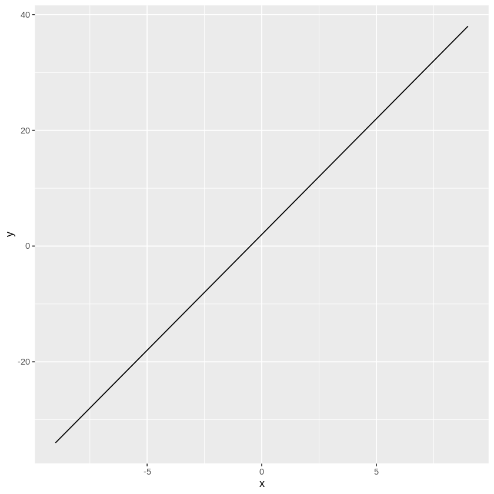
    


Weil wir mit `ggplot` Darstellungen überlagern können, dürfen wir die beiden Funktionen selbstverständlich auch in einem Diagramm darstellen.


```R
Darstellungsbereich %>%
    ggplot(aes(x)) + 
        geom_line(stat = "function", fun = f1) + 
        geom_line(stat = "function", fun = f2)
```


    
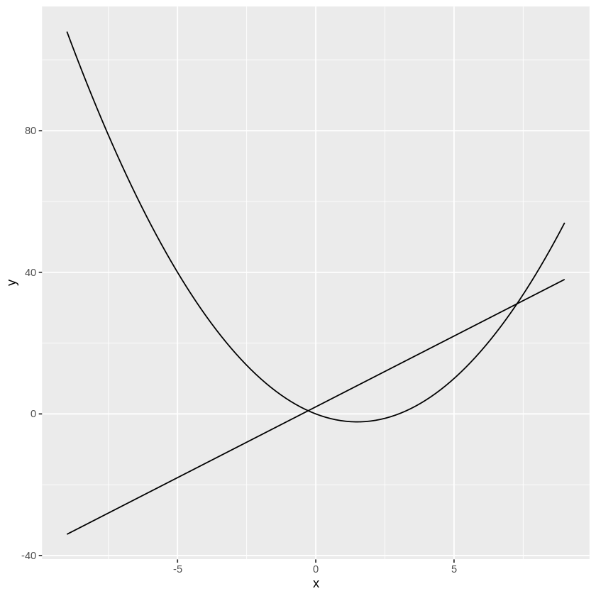
    


Wir wollen die beiden Graphen noch visuell hervorheben, damit wir wissen, welcher Graph zu welcher Funktion gehört. Dabei überlassen wir die Auswahl der Farben `ggplot`, womit wir sicherstellen, dass die Farben nicht zu ähnlich sind. Dazu verwenden wir den Trick, dass wir jeder Geometrie-Funktion ergänzende ästhetische Parameter übergeben dürfen.


```R
Darstellungsbereich %>%
    ggplot(aes(x)) + 
        geom_line(stat = "function", fun = f1, aes(colour = "f1(x) = x ^ 2 - 3 * x")) + 
        geom_line(stat = "function", fun = f2, aes(colour = "f2(x) = 4 * x + 2"))
```


    
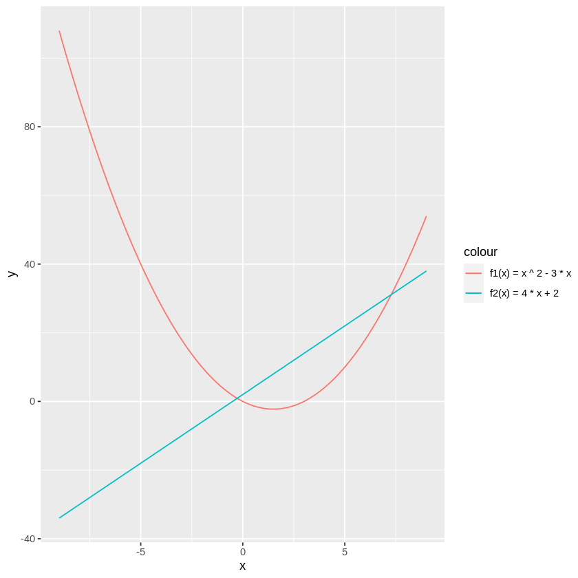
    


Die Legende für unser Diagramm hat keine schöne Überschrift. Das passen wir noch schnell mit der `labs()`-Funktion(für *labels* bzw. *Beschriftungen*) an. Dort geben wir für den ästhetischen Parameter die richtige Beschriftung an. In unserem Fall ist das `colour`.


```R
Darstellungsbereich %>%
    ggplot(aes(x)) + 
        geom_line(stat = "function", fun = f1, aes(colour = "f1(x) = x ^ 2 - 3 * x")) + 
        geom_line(stat = "function", fun = f2, aes(colour = "f2(x) = 4 * x + 2")) +
        labs(colour = "Funktion")
```


    
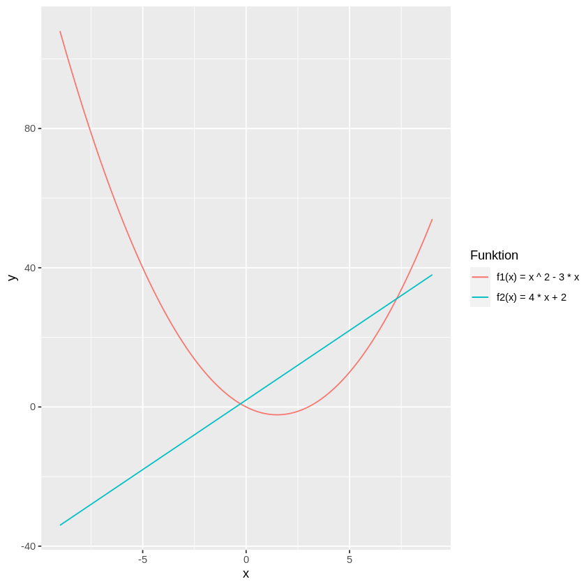
    

## Berechnete Visualisierungen

Wir haben im Abschnitt zu einfachen Visualisieren in R die Funktion  `ggplot()` kennengelernt, um zwei Vektoren zu visualisieren.

Sehr häufig wir einen Vektor und wollen sehen, wie die Werte in diesem Vektor verteilt sind. Wir sollen also die Werte in dem Vektor für die Visualisierung **aggregieren**. Hierbei handelt es sich um eine so häufige Aufgabe, dass uns `ggplot()` diese Aufgabe abnimmt. 

Für verschiedene Visualisierungen hat `ggplot()` vordefinierte Funktionen, mit denen Werte für die Visualisierung aufbereitet werden, wenn die Werte für eine Achse fehlen. Diese Funktionen müssen wir im Detail nicht kennen, denn `ggplot()` wählt diese automatisch für uns aus. 

Wir lernen heute zwei wichtige berechnete Visualisierungen kennen. 

1. Das Histogramm 
2. Den Box-Plot

### Histogramm

::: {#def-histogramm}
Also **Histogramm** werden Balkendiagramme bezeichnet, die die *Häufigkeiten* von gemessenen Werte darstellen. 
:::

Das übliche Balkendiagramm erzeugen wir mit der Funktion `geom_bar()`. Diese Funktion verwenden wir immer, wenn unsere gemessenen Werte nur auf bestimmte Werte fallen (können). Die `geom_bar()`-Funktion zählt für jeden gemessenen Wert die Anzahl der Datensätze, in denen dieser Wert vorkommt. 

Gelegentlich sind unserer Werte so verteilt, dass nur selten zwei oder mehr Datensätze gleiche Werte haben. In solchen Fällen verwenden wir die Funktion `geom_histogram()`. Diese Funktion teilt den gesamten Wertebereich in gleichmässige Intervalle und zählt die Anzahl der Datensätze im jeweiligen Intervall.

Das folgende Beispiel veranschaulicht die Situation. 

Wir verwenden die Stichprobe `digitales_umfeld1.csv`. In dieser Stichprobe gibt es den Vektor `tage`, der das Alter der beantwortenden Person in Tagen festhält. Dabei handelt es sich rein formell um *diskrete Werte*. Wenn wir die Verteilung dieser Werte in einem Histogramm für *diskrete Werte* darstellen würden, dann erhalten wir das folgende Histogramm: 

```R
library(tidyverse)

digitales_umfeld = read_delim("digitales_umfeld1.csv")

digitales_umfeld %>% 
    ggplot(aes(x = tage)) +
        geom_bar()
```

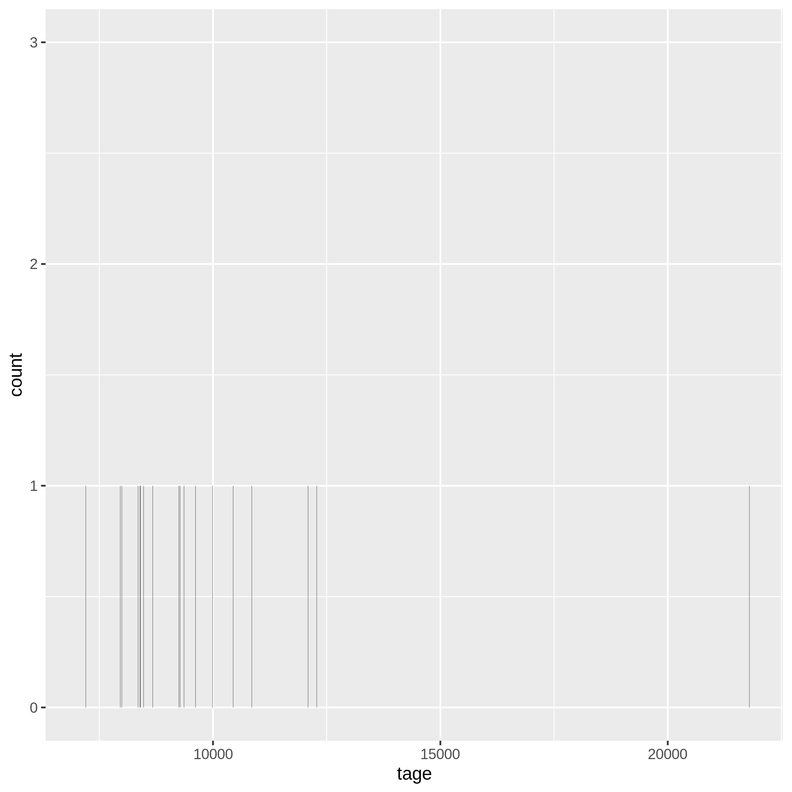{#fig-tage-barplot}

Auf diesem Histogramm kann man keine Verteilung erkennen. Es scheint, als ob alle Werte genau einmal vorkommen. Der Wertebereich der y-Achse deutet aber darauf hin, dass einzelne Werte bis zu drei Mal vorkommen. Diese Balken sind jedoch so dünn, dass sie nicht im Diagramm dargestellt werden können. 

Die Werte in diesem Vektore verhalten sich also wie *kontinuierliche Werte*. Deshalb verwenden wir die Funktion `geom_histogram()`, um die Daten darzustellen. 

```R
digitales_umfeld %>% 
    ggplot(aes(x = tage)) +
        geom_histogram()
```

{#fig-tage-histo}

Aus diesem Histogramm können wir wesentlich besser die Verteilung des Alters in Tagen ablesen, weil der Wertebereich in grössere Segmente gegliedert wurde und die Datensätze in diesen Segmenten gezählt wurden.

::: {.callout-note}
## Merke 
Histogramme für *kontinuierliche Werte* erzeugen wir mit der Funktion `geom_histogram()`. Histogramme für *diskrete Werte*  erzeugen wir mit der `geom_bar()`-Funktion.
:::

#### Histogramme selbst berechnen

Gelegentlich haben uns bereits die Häufigkeiten für ein Histogramm als Teil unserer Stichproben. In solchen Fällen verwenden wir die Funktion `geom_col()`, um die Daten als Histogramm darzustellen. In diesem Fall müssen wir neben der x-Achse auch den Vektor mit den berechneten Werten für die y-Achse an `ggplot()`'s `aes()`-Funktion übergeben.

### Box-Plot

::: {#def-boxplot}
Ein Box-Plot stellt die Verteilung eines Stichprobenvektors mit Hilfe von Quartilen dar. 
:::

Box-Plots werden mit der `geom_boxplot()` Funktion dargestellt. 

Beim Box-Plot wird der Median als dicke Linie dargestellt. Der Interquartilsabstand wird als Rechteck (*Box*) um den Median visualisiert (2. und 3. Quartil). Dabei liegt die Hälfte der aller gemessenen Werte innerhalb der dargestelltn Box.  Der gesamte Umfang wird durch Linien links (1. Quartil) und rechts (4. Quartil) vom Interquartilsabstand dargestellt. Manchmal werden Punkte an den äusseren Rändern  dargestellt. Diese Punkte stellen sog. Ausreisser dar.

Wiederholen wir die Visualisierung für unsere Alterstage mit einem Boxplot, dann erhalten wir folgendes Ergebnis: 

```R
digitales_umfeld %>% 
    ggplot(aes(x = tage)) +
        geom_boxplot()
```

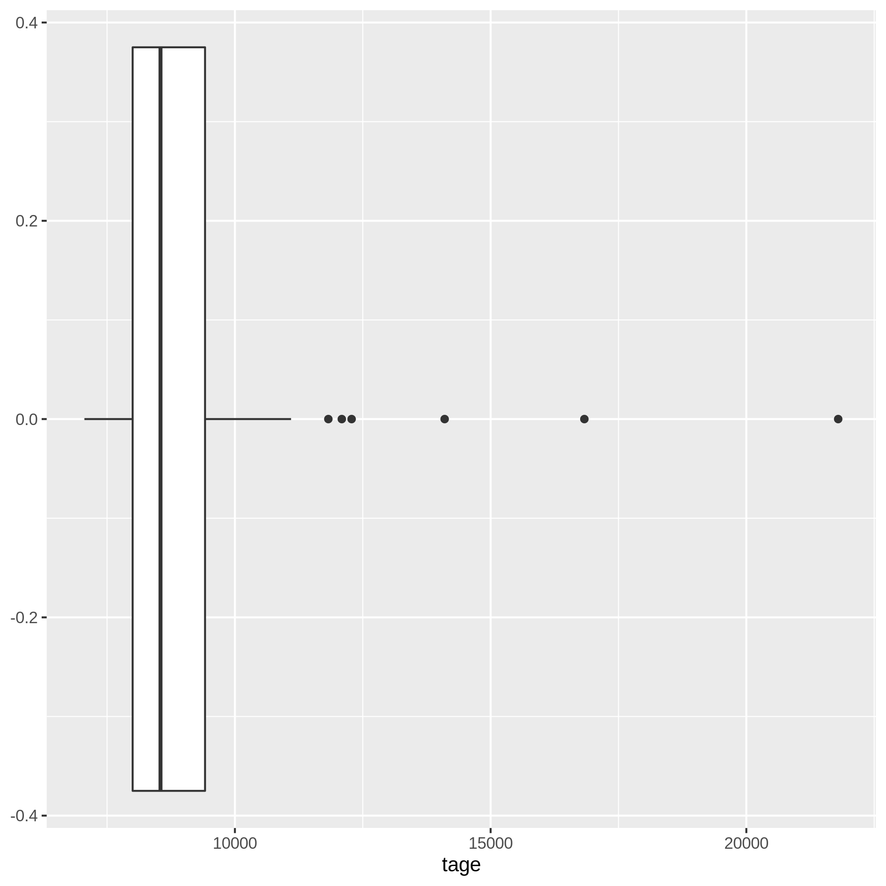{#fig-tage-boxplot}

Wir erkennen jetzt leicht, dass der Grossteil der Gruppe unter 10000 Tagen alt ist und dass es sechs Ausreisser gibt, die deutlich älter als der Grossteil der Gruppe sind. 

### Ausgleichsgeraden

Die dritte wichtige visuelle Analysetechnik sind Punktwolken. Bei Punktwolken stellen wir die Werte von zwei Vektoren ähnlich einer Kreuztabelle gegenüber und überprüfen das gemeinsame Auftreten von Werten in den Vektoren unserer Messungen.

Für Punktwolken stehen zwei Funktionen zur Verfügung: 

1. `geom_point()` für kontinuierliche Werte.
2. `geom_jitter()` für diskrete Werte.

<!-- 
[[fa-download] beispieldaten.csv](https://moodle.zhaw.ch/mod/resource/view.php?id=635316){.btn.btn-primary}
-->

```R
daten = read_delim("digitales_umfeld_geraete_fm_att.csv");

daten %>%
    filter(sozial_like_freunde >= -1 & 
           sozial_like_unbekannt >= -1 ) %>%
    ggplot(aes(x = sozial_like_unbekannt, 
               y = sozial_like_freunde)) + 
        geom_point()
```

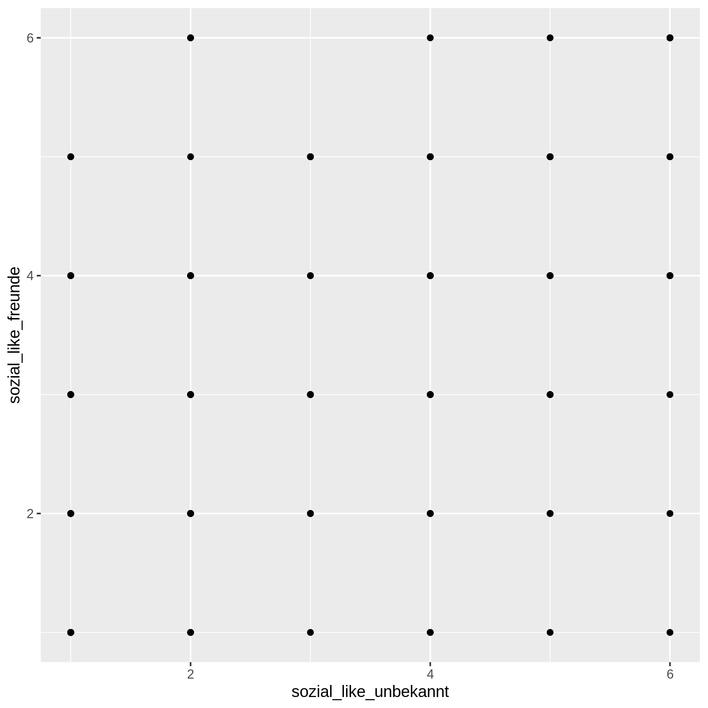{}
    


In diesem Beispiel sehen wir, dass alle Werte genau an den gleichen Punkten im Koordinatensystem liegen. Ein solcher Plot ist ein gutes Beispiel für *diskrete Werte*. Bei diskreten Werten fallen alle Messungen genau auf bestimmte Punkte im Wertebereich. Kontinuierliche Werte weichen oft ein wenig voneinander ab, sodass wir eine Wolke sehen würden. 

Um Punktwolken für diskrete Werte zu erzeugen, verwenden wir die `geom_jitter()`-Funktion. Diese Funktion erzeugt einen kleinen Bereich um den diskreten (echten) Messwert und verteilt die einzelnen Datensätze mit einem zufälligen Abstand vom echten Messwert. Dadurch wird das gemeinsame Auftreten von Werten deutlich sichtbar, sofern es Gemeinsamkeiten gibt.


```R
daten %>%
    filter(sozial_like_freunde >= -1 & 
           sozial_like_unbekannt >= -1 ) %>%
    ggplot(aes(x = sozial_like_unbekannt, 
               y = sozial_like_freunde)) + 
        geom_jitter()
```

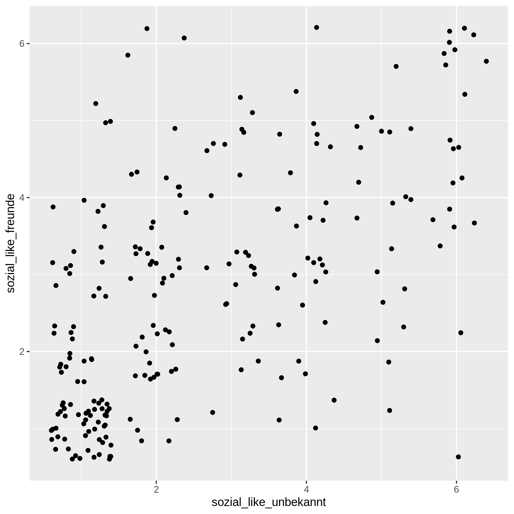{}

Durch den leichten Versatz sind nun gehäufte Wertepaare leichter zu erkennen. Bei Jitter-Plots dürfen wir aber nie vergessen, dass die Punkte zwar Messungen repräsentieren, aber leicht vom echten Messpunkt versetzt dargestellt wurden.

In diesem Beispiel können wir eine Häufung entlang der nach rechts aufsteigenden Diagonalen erkennen. Solche Häufungen in Punktwolken deuten auf *Korrelationen* hin. 

::: {#def-korrelation}
Eine **Korrelation** bezeichnet das wiederholte Auftreten von Wertepaaren in Stichproben. Korrelationen deuten auf Zusammenhänge zwischen zwei Vektoren hin.
:::

Ähnlich wie beim Vergleichen mit Histogrammen ist es bei Punktwolken hilfreich, für die Wolke eine Referenz zur Orientierung zu haben. Das erreichen wir mit der `geom_smooth()`-Funktion. Die Methode `lm` steht für "lineares Modell". In diesem Modell versteckt sich das Wort Linie und deshalb *erzeugt ein lineares Modell immer eine Ausgleichsgerade*. Der graue Bereich zeigt uns die Spanne des Fehlerbereichs für diese Gerade. Bei einer linearen Korrelation sollte diese Gerade den Häufungen in unserem Plot ungefähr folgen.


```R
daten %>%
    filter(sozial_like_freunde >= -1 & 
           sozial_like_unbekannt >= -1 ) %>%
    ggplot(aes(x = sozial_like_unbekannt, 
               y = sozial_like_freunde)) + 
        geom_jitter() +
        geom_smooth(method="lm")
```

{}


Das folgende Beispiel zeigt eine Punktwolke, bei der die Wertepaare zufällig über den gesamten Wertebereich gestreut sind. In diesem Fall ist eine Korrelation kaum wahrscheinlich. 


```R
daten %>%
    filter(sozial_like_freunde  >= -1 & 
           sozial_freundschaftsanfragen_aus_netzwerk >= -1 ) %>%
    ggplot(aes(x = sozial_like_freunde, 
               y = sozial_freundschaftsanfragen_aus_netzwerk)) + 
        geom_jitter() +
        geom_smooth(method="lm")
```

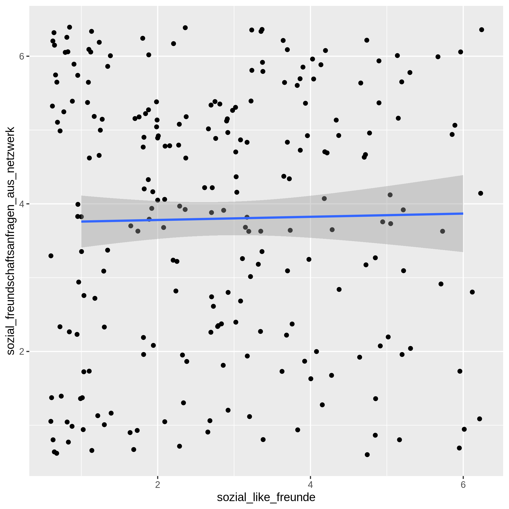{}

    
Im Beispiel ist die Ausgleichsgerade fast waagerecht. Wenn eine Ausgleichsgerade fast waagerecht ist, dann liegt in der Regel auch keine *Korrelation* vor.

Es gibt auch nicht-lineare Korrelationen. In diesem Fall sehen wir Häufungen in bestimmten Teilen unserer Punktwolken oder unsere Punkte folgen einer Kurve. Solche Korrelationen müssten einer entsprechenden "Ausgleichskurve" folgen. Eine solche Ausgleichskurve erzeugen wir mit `loess` als Ausgleichsmethode. 

Wenn eine Ausgleichskurve fast gerade ist, dann sollten wir eine lineare Korrelation annehmen. Ein Beispiel für eine fast gerade Ausgleichskurve zeigt uns der nächste Plot. 


```R
daten %>%
    filter(sozial_like_freunde >= -1 & 
           sozial_like_unbekannt >= -1 ) %>%
    ggplot(aes(x = sozial_like_unbekannt, 
               y= sozial_like_freunde)) + 
        geom_jitter() +
        geom_smooth(method = "loess")
```

{}


## Spezielle Visualisierungen

### Torten- und Donut-Diagramme

::: {.callout-important} 
Tortendiagramme und Donut-Diagramme werden oft falsch interpretiert, weil Kreisflächen schwerer verglichen werden können als die Höhen von Balken. Sie sollten nur zur Illustration, aber nie zur Argumentation verwendet werden.
:::

R kann auch Plots erstellen, die nur einen Datenvektor umfassen. In diesem Fall wird der zweite Vektor für die y-Achse aus den Werten des Vektors berechnet. Diese Möglichkeit haben wir schon bei der Erstellung von Histogrammen kennengelernt. 

Nehmen wir das folgende Beispiel: Wir erstellen ein Stichprobenobjekt mit einem Vektor `q00_demo_gen`, der die Werte `1 : Keine Angabe`, `2 : Weiblich` und `3 : Männlich` enthält.


```R
daten2 = tibble(
    q00_demo_gen = c("2 : Weiblich", "2 : Weiblich", "3 : Männlich", 
"2 : Weiblich", "2 : Weiblich", "2 : Weiblich", "2 : Weiblich", 
"2 : Weiblich", "2 : Weiblich", "3 : Männlich", "3 : Männlich", 
"3 : Männlich", "3 : Männlich", "2 : Weiblich", "2 : Weiblich", 
"3 : Männlich", "3 : Männlich", "2 : Weiblich", "3 : Männlich", 
"2 : Weiblich", "2 : Weiblich", "2 : Weiblich", "2 : Weiblich", 
"3 : Männlich", "2 : Weiblich", "3 : Männlich", "2 : Weiblich", 
"3 : Männlich", "3 : Männlich", "2 : Weiblich", "2 : Weiblich", 
"3 : Männlich", "2 : Weiblich", "3 : Männlich", "2 : Weiblich", 
"3 : Männlich", "2 : Weiblich", "2 : Weiblich", "3 : Männlich", 
"2 : Weiblich", "2 : Weiblich", "2 : Weiblich", "2 : Weiblich", 
"3 : Männlich", "3 : Männlich", "2 : Weiblich", "2 : Weiblich", 
"3 : Männlich", "3 : Männlich", "2 : Weiblich", "3 : Männlich", 
"3 : Männlich", "2 : Weiblich", "2 : Weiblich", "2 : Weiblich", 
"3 : Männlich", "2 : Weiblich", "3 : Männlich", "3 : Männlich", 
"3 : Männlich", "2 : Weiblich", "3 : Männlich", "3 : Männlich", 
"2 : Weiblich", "2 : Weiblich", "3 : Männlich", "2 : Weiblich", 
"2 : Weiblich", "2 : Weiblich", "2 : Weiblich", "3 : Männlich", 
"3 : Männlich", "3 : Männlich", "2 : Weiblich", "3 : Männlich", 
"3 : Männlich", "3 : Männlich", "3 : Männlich", "3 : Männlich", 
"3 : Männlich", "3 : Männlich", "3 : Männlich", "2 : Weiblich", 
"3 : Männlich", "2 : Weiblich", "2 : Weiblich", "2 : Weiblich", 
"2 : Weiblich", "3 : Männlich", "3 : Männlich", "3 : Männlich", 
"3 : Männlich", "3 : Männlich", "3 : Männlich", "2 : Weiblich", 
"2 : Weiblich", "3 : Männlich", "3 : Männlich", "2 : Weiblich", 
"3 : Männlich", "3 : Männlich", "2 : Weiblich", "2 : Weiblich", 
"2 : Weiblich", "3 : Männlich", "3 : Männlich", "2 : Weiblich", 
"2 : Weiblich", "2 : Weiblich", "2 : Weiblich", "2 : Weiblich", 
"2 : Weiblich", "2 : Weiblich", "2 : Weiblich", "3 : Männlich", 
"3 : Männlich", "2 : Weiblich", "3 : Männlich", "2 : Weiblich", 
"3 : Männlich", "3 : Männlich", "3 : Männlich", "3 : Männlich", 
"3 : Männlich", "3 : Männlich", "3 : Männlich", "3 : Männlich", 
"2 : Weiblich", "3 : Männlich", "3 : Männlich", "2 : Weiblich", 
"3 : Männlich", "3 : Männlich", "2 : Weiblich", "3 : Männlich", 
"2 : Weiblich", "3 : Männlich", "2 : Weiblich", "2 : Weiblich", 
"3 : Männlich", "2 : Weiblich", "3 : Männlich", "3 : Männlich", 
"2 : Weiblich", "3 : Männlich", "3 : Männlich", "3 : Männlich", 
"3 : Männlich", "2 : Weiblich", "3 : Männlich", "2 : Weiblich", 
"2 : Weiblich", "3 : Männlich", "2 : Weiblich", "2 : Weiblich", 
"3 : Männlich", "2 : Weiblich", "3 : Männlich", "3 : Männlich", 
"3 : Männlich", "2 : Weiblich", "3 : Männlich", "2 : Weiblich", 
"2 : Weiblich", "3 : Männlich", "2 : Weiblich", "2 : Weiblich", 
"3 : Männlich", "2 : Weiblich", "3 : Männlich", "3 : Männlich", 
"2 : Weiblich", "3 : Männlich", "3 : Männlich", "3 : Männlich", 
"3 : Männlich", "2 : Weiblich", "2 : Weiblich", "2 : Weiblich", 
"2 : Weiblich", "1 : Keine Angabe", "3 : Männlich", "3 : Männlich", 
"2 : Weiblich", "2 : Weiblich", "2 : Weiblich", "2 : Weiblich", 
"3 : Männlich", "3 : Männlich", "3 : Männlich", "3 : Männlich", 
"3 : Männlich", "3 : Männlich", "3 : Männlich", "3 : Männlich", 
"2 : Weiblich", "3 : Männlich", "2 : Weiblich", "3 : Männlich", 
"2 : Weiblich")
)
```

Uns interessiert nun: ***Wie oft kommen die drei möglichen Werte in unserer Stichprobe vor?*** 

Wir können die Werte mit `count()` selbst berechnen oder `ggplot` die Arbeit überlassen. Anstelle der `geom_col()`-Funktion verwenden wir nun die `geom_bar()`-Funktion. `geom_bar()` erwartet einen Vektor für die x-Achse und berechnet für die y-Achse das Auftreten der Werte, so wie wir es mit der `count()`-Funktion auch bestimmen würden.

```R
daten2 %>%
    count(q00_demo_gen)

daten2 %>%
    ggplot(aes(x = q00_demo_gen)) +
        geom_bar()
```

<div class?="alert alert-secondary">
<table>
<thead>
	<tr><th scope=col>q00_demo_gen</th><th scope=col>n</th></tr>
	<tr><th scope=col>&lt;chr&gt;</th><th scope=col>&lt;int&gt;</th></tr>
</thead>
<tbody>
	<tr><td>1 : Keine Angabe</td><td>  1</td></tr>
	<tr><td>2 : Weiblich    </td><td> 95</td></tr>
	<tr><td>3 : Männlich    </td><td>104</td></tr>
</tbody>
</table>
</div>
    
{}
    

Mit diesem Plot können wir die Unterschiede in unserer Werteverteilung leichter erkennen. 

Für Präsentationen ist so ein Plot aber nicht wahnsinnig attraktiv. Färben wir den Plot also ein. Das machen wir, indem wir den Vektornamen auch  für die Füllung der Balken verwenden. `ggplot` wählt nun für jeden Wert in diesem Vektor eine eigene Farbe aus. Dadurch färben sich unsere Balken ein. 


```R
daten2 %>%
    ggplot(aes(x=q00_demo_gen, fill = q00_demo_gen)) +
        geom_bar()
```

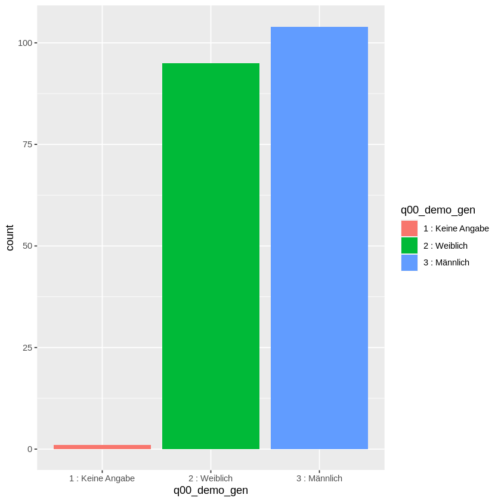{}
    

Für Histogramme verwenden wir normalerweise ein kartesisches Koordinatensystem. Wir können aber auch ein anderes Koordinatensystem wählen. Eine Variante sind **polare Koordinaten**. Mit einem polaren Koordinatensystem erreichen wir kreisförmige Darstellungen. Wir müssen dazu die Dimension, die auf das Zentrum des Diagramms zeigt, festlegen und als Parameter übergeben. In unserem Fall ist das die y-Dimension.

Wir stellen unsere Daten in einem polaren Koordinatensystem dar, indem wir mit der `coord_polar()`-Funktion ggplot mitteilen, dass wir ein anderes Koordinatensystem wünschen. 

```R
daten2 %>%
    ggplot(aes(x=q00_demo_gen, fill = q00_demo_gen)) +
        geom_bar() +
        coord_polar("y") 
```


    
{}

Unser Plot hat jetzt unschöne Beschriftungen. Die werden wir mit einem Formatierungsthema los. `ggplot` hat verschiedenen Formatierungen als Thema vordefiniert. Eines davon ist das Thema `void`. Diese Formatierung entfernt alle Hintergründe, Achsen und Beschriftungen ausser Legenden.


```R
daten2 %>%
    ggplot(aes(x=q00_demo_gen, fill = q00_demo_gen)) +
        geom_bar() +
        coord_polar("y") +
        theme_void()
```


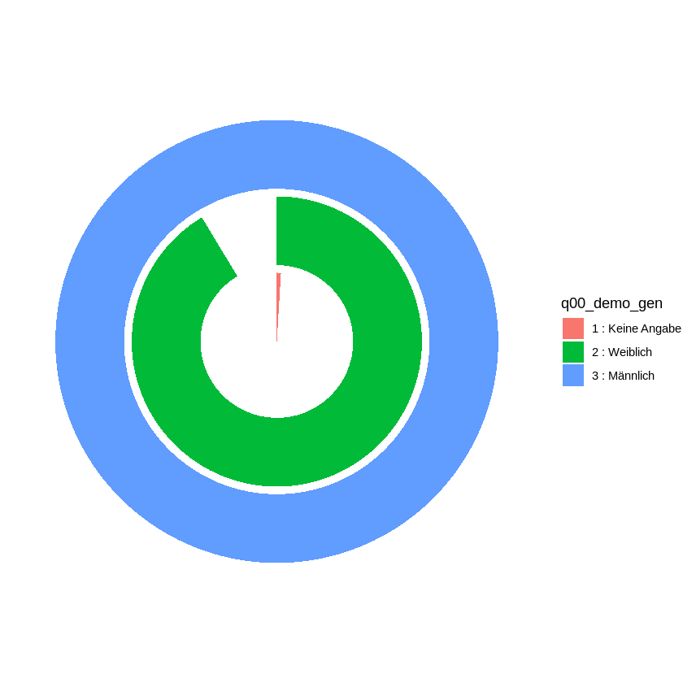{}
 
Das sieht doch gleich viel besser aus.

::: {.callout-note}
Solche ringartigen Visualisierungen werden  als Zielscheiben- oder  **Donut-Diagramme** bezeichnet.
:::


Manchmal wollen wir alle Balken  übereinander stapeln. Das erreichen wir, indem wir für die x-Achse einen konstanten Wert angeben. Z.B. nehmen wir dazu die leere Zeichenkette. So vermeiden wir, dass eine merkwürdige Beschriftung in unserem Diagramm auftaucht. Damit wir die Balken auseinanderhalten können, färben wir sie wie oben ein. 


```R
daten2 %>%
    ggplot(aes(x ="", fill = q00_demo_gen)) +
        geom_bar() 
```


{}    
    
Mit der Funktion `coord_flip` vertauschen wir die Achsen und drehen so unser Diagramm.

```R
daten2 %>%
    ggplot(aes(x ="", fill = q00_demo_gen)) +
        geom_bar() +
        coord_flip()
```

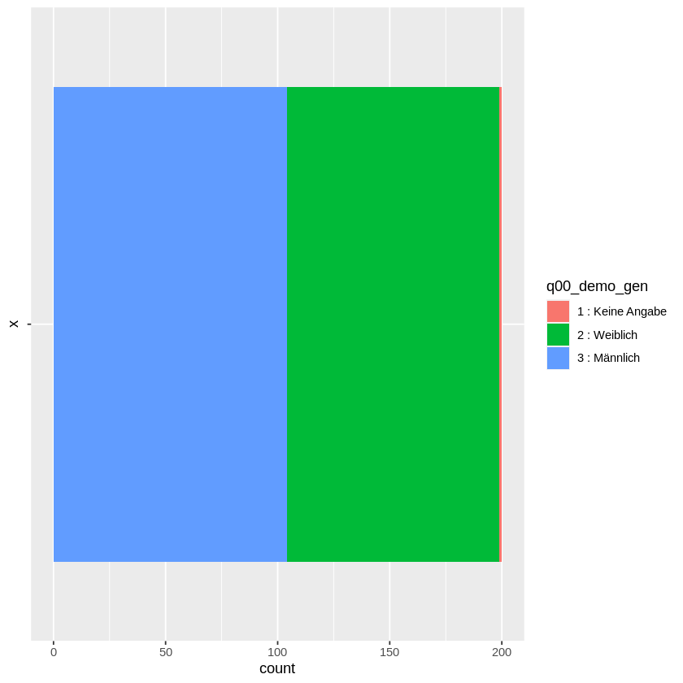{}
    
Wir erkennen nun deutlich, dass `ggplot` immer versucht möglichst viel Fläche zu nutzen. 

Das Interessante an dieser Darstellung ist aber nicht dieses Format, sondern dass wir dieses Diagramm ebenfalls in einem polaren Koordinatensystem darstellen können. 


```R
daten2 %>%
    ggplot(aes(x ="", fill = q00_demo_gen)) +
        geom_bar() +
        coord_polar("y") + 
        theme_void()
```

{}
   

Auf diese Weise erzeugen wir Tortendiagramme. 

### Bubble-Plots


