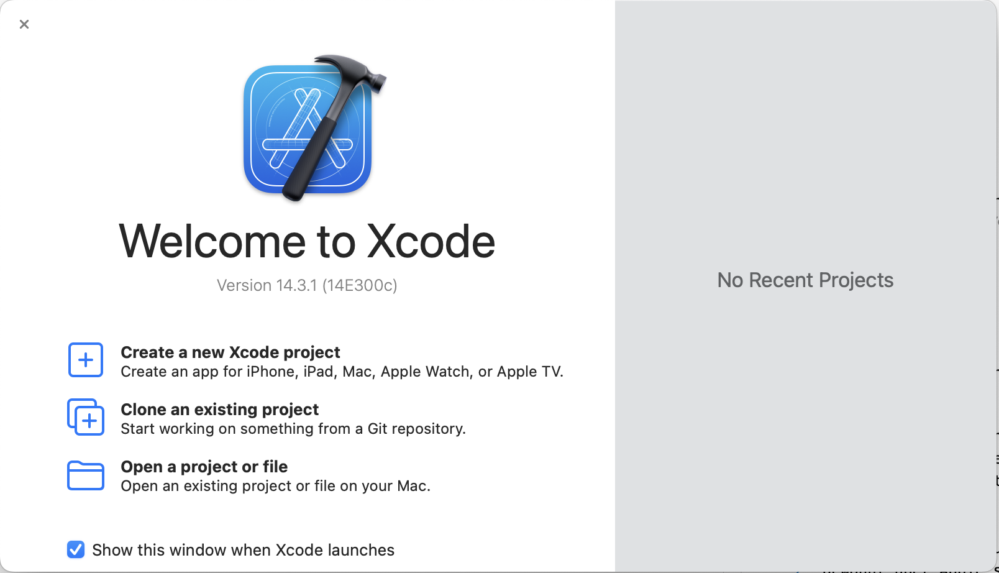

# Tool Chain

::: {.callout-warning}
## Work in Progress
:::

## R installieren

Die Installation von R ist einfach. Auf der [R-Project](https://cran.r-project.org/) Webseite kann das Installationspaket für das jeweilige Betriebssystem heruntergeladen werden. Die Installation erfolgt wie gewohnt über den Installer.

::: {.callout-warning}
## MacOS
Viele R-Bibliotheken benötigen zusätzliche Komponenten, damit sie funktionieren. Diese Komponenten müssen zusätzlich *kompiliert* werden. Unter MacOS benötigt R dafür die App **XCode** und die **XCode Command Line Tools**.

Beide Komponenten stehen unter MacOS kostenlos zur Verfügung. XCode wird wie gewohnt über Apple's AppStore installiert. Nach der Installation muss XCode einmal gestartet werden, um die Lizenzbedingungen zu akzeptieren. Anschliessend sollten die notwendigen Ergänzungen für die Entwicklung unter MacOS installiert werden.

Nach erfolgreicher Installation erscheint eine Abfrage, zum Starten eines neuen Projekts (@fig-xcode-start).

{#fig-xcode-start}

Damit ist die Installation von *XCode* abgeschlossen. Nun 

```bash 
xcode-select --install
```

Anschliessend folgen mehrere Abgragen zur Installation der XCode-Command-Line Komponenten. Nach der Installation kann das Terminal und XCode wieder geschlossen werden.

XCode wird regelmässig grösseren Änderungen unterzogen. Diese Änderungen erfolgen oft im April, Juni und September. Nach einem Update von XCode müssen die Command-Line Tools ebenfalls erneut installiert werden. Ausserdem ist es notwendig, dass die Lizensbedingungen erneut akzeptiert werden, sonst lassen sich R-Bibliotheken nicht mehr kompilieren. 
:::

### Überprüfen der Installation

```r
sessionInfo()
```

## Graphische Oberflächen für R

R hat keine eigene Benutzeroberfläche und ist auf eine externe Entwicklungsumgebung angewiesen. Eine solche Entwicklungsumgebung muss zusätzlich installiert werden. Die bekanntesten Entwicklungsumgebungen sind:

- RStudio
- Visual Studio Code
- Jupyter Notebooks

### RStudio


### Visual Studio Code


### Jupyter Notebooks


## R-Bibliotheken installieren

```r
install.packages(package_name)
```

::: {#exm-install-packages}
## Installieren der tidyverse-Bibliotheken
```r
install.packages("tidyverse")
```
:::

### pak

### tidyverse

## IDE

### RStudio

### VS Code

### Jupyter Notebook
